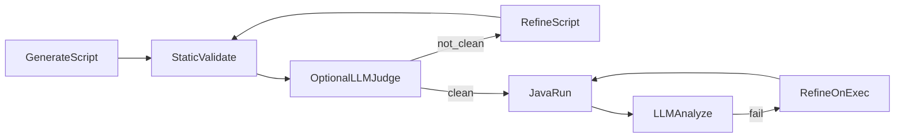

# Python orchestrator: feedback loops

This diagram summarizes how the AI orchestrator uses **bounded** analysis/refinement loops (see [`python-orchestrator/main.py`](../python-orchestrator/main.py)).

Generation is capped by `MAX_GEN_ATTEMPTS`; execution retries by `MAX_EXEC_RETRIES`.

**Notes**

- **Optional LLM judge** is controlled by `ENABLE_LLM_JUDGE` in the environment; when off, approval is driven by static validation only.
- **Refine on execution** builds feedback from failed steps and LLM analysis, then calls the same refinement path as generation.

View this file in GitHub, GitLab, or an editor with Mermaid preview to render the diagram.
